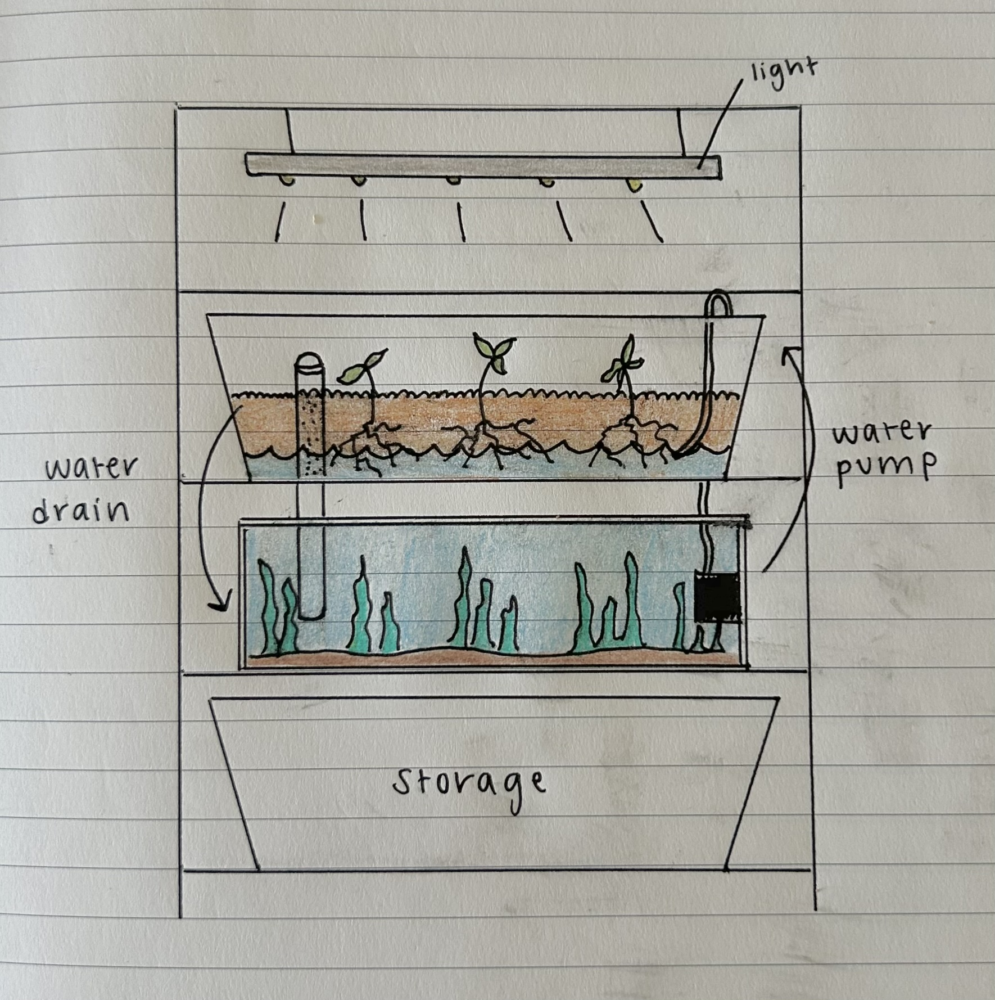

<!--  -->

This is the home of my latest project/hobby/obsession, as my awesome boyfriend **[John](https://johnsutor.com/projects/aquaponics)** and I attempt to build a thriving aquaponics ecosystem in our NYC apartment (and learn a lot about combining nature and tech along the way).

A huge thanks is owed to **[\Art](https://backslash.org/)** 🎨 and Cornell Tech 🐻 for their microgrant program that has provided such valuable support to get this project started!

### 📋 *5.20.24* -- Planning the design

John and I just graduated and are soon starting our new jobs and moving into a new apartment. With all of these changes, we've decided to delay the building process until after our move, but I've kept busy reading up on aquaponics design and maintenance. After hours of perusing online videos and articles, sorting through various opinions on Reddit, and talking with local tank enthusiasts we settled on a few key design choices.

#### Selecting a media-based, continuous-flow system

We opted for a media-based aquaponics system, which means our plants are housed in a separate grow-bed filled with clay gravel. Water from the tank is pumped through the clay substrate, where the rooted plants filter out nutrients from the fish waste. Additionally, we opted for a continuous-flow system, which means that water is continuously being cycled from the tank through the bottom few inches of the media bed, before draining out the opposite side of the bed. This is an alternative to a flood & drain system, where a timed pump periodically fills the media bed with water before letting it drain completely. While continuous flow systems are somewhat limited to edible plants that don't mind a continuous stream of water past their roots, it also provides a much more stable water and nutrient level for the fish living in the tank.

<figcaption><b>Fig 1.</b> A final sketch of the design where water is pumped into the clay substrate on the right, and then flows back into the tank on the left.</figcaption>

#### Building vertically

We first decided to build a vertical system, where the grow bed of edible plants was placed above the aquatic tank for two primary reasons:
- To conserve the amount of space the system took up in our apartment.
- To reduce the odds of any potential leaks, as water that escapes from the grow bed will fall into the tank below.

We initially hoped to find or build some sort of wooden cabinet to house the structure, but quickly realized that the weight of the system is much greater than most furniture can hold. Furthermore, tank leaks and failures are almost always caused from the tank being on an uneven surface, so a sturdy & even support structure is essential. However, many commercially-available tank cases only consist of one shelf for a single tank to stand. In our case, we needed to have an equally strong secondary shelf above the tank to hold the grow bed. Ultimately, we decided to use an industrial metal shelf as the foundation of the system.

#### Limiting the tank size

With similar concerns in mind, we also decided to limit the tank size to 20 gallons, as the grow-bed above also contains an additional 10-15 gallons of water. Considering a gallon of fresh water weighs roughly 8.34lbs, this puts the entire weight of the system's water alone somewhere between 250 and 290lbs. Considering the weight threshold of the industrial shelving, and given that we live on a high floor in our building, we decided to constrain the system to this size for safety & flooding-risks. The tradeoff of this apartment-scale system is that we can only support a grow-bed of about 3 square feet, and are limited to smaller crops such as greens and herbs.

#### Starting with fake plants inside the tank

A key goal of our design is to give the fish and other aquatic creatures who live in our tank a safe and enjoyable habitat to live in. With this in mind, we decided to heavily-plant the tank to create lots of places for exploring and hiding. However, we also need to support the edible plants in the grow-bed without over-stocking the tank. Therefore, we have decided to start with fake plants inside of the tank, so that we can create a realistic environment for a small amount of creatures while reserving all of their waste nutrients for the edible plants. With time we may add aquatic plants to the tank, but initially we want to ensure there are enough nutrients to support both the ecosystem's plants and animals.

### 💰 *6.25.24* -- Purchasing components

After finishing the initial planning, it has taken quite a while to find all the right parts, in part because we've also been quite busy moving into the new apartment and starting work. These are all of the components we have purchased and their costs *(updates in italics)*.

#### Structural Components
- 3-shelf Home Depot adjustable metal rack -- [$165.39](https://www.homedepot.com/p/Tileon-3-Heavy-Duty-Wire-Rack-Metal-Shelves-1050-LBS-Height-Adjustable-Metal-Garage-Storage-Shelves-Chrome-YQHDRA093/330445086)
- 2 IKEA Sockerbit bins (grow bed + storage) -- [$59.98](https://www.ikea.com/us/en/p/sockerbit-storage-box-with-lid-white-40522088/)
- 20 gallon long Aqueon tank -- [$29.99](https://www.petco.com/shop/en/petcostore/product/aga-20g-30x12x12-lng-bk-tank-170933?store_code=3713&mr:device=c&mr:adType=pla_with_promotionlocal&gad_source=1&adlclid=ADL-83c348cb-ed98-4678-a7dc-748c351ef19e)

#### Building Tools 
- 1" x 2' PVC pipe -- [$3.14](https://www.homedepot.com/pep/IPEX-1-in-x-24-in-Rigid-PVC-Schedule-40-Pipe-22412/202300506?source=shoppingads&locale=en-US&pla&mtc=SHOPPING-BF-CDP-GGL-D26P-026_001_PIPE_FITTING-NA-NA-NA-PMAX-NA-NA-NA-NA-NBR-NA-NA-NEW-PMax_BHU24&gad_source=1)
- 1" [male](https://www.homedepot.com/pep/Cantex-1-in-PVC-Male-Terminal-Adapter-Conduit-Fitting-for-Cantex-PVC-Conduits-R5140105/202043379?source=shoppingads&locale=en-US&pla&mtc=SHOPPING-CM-CML-GGL-D27E-027_006_CONDUIT_FIT-NA-NA-NA-PMAX-5872413-NA-NA-NA-NBR-NA-NA-NEW-NA_2024_WHU24&gad_source=1) + [female](https://www.homedepot.com/pep/Carlon-1-in-PVC-Female-Adapter-E942F-10-HD/100403999?source=shoppingads&locale=en-US&pla&mtc=SHOPPING-RM-RMP-GGL-D27E-NA-NA-CARLON-NA-PMAX-NA-NA-MK863159001-24205-NBR-1131-NA-VNT-FY24_Q1_Q4_Thomas_Betts_ABB_D27_RM__AON&gad_source=1) PVC adaptors -- $4.14
- Diablo 1.25" spade drill bit (already owned a drill) -- [$6.77](https://www.homedepot.com/p/DIABLO-1-1-4-in-x-6-in-High-Speed-Steel-SPEEDemon-Spade-Drill-Bit-1-Piece-DSP2150/312953382)
- Everbilt 1/2" x 20' clear vinyl tubing -- [$12.97](https://www.homedepot.com/p/Everbilt-5-8-in-O-D-x-1-2-in-I-D-x-20-ft-Clear-PVC-Vinyl-Tube-702473/207144400)
- Hack saw -- [$5.47](https://www.homedepot.com/p/Husky-6-in-Mini-Hacksaw-with-Replaceable-Carbon-Steel-Blade-80-510-111/304583781)
- Imagitarium filter sponges - [$4.99](https://www.petco.com/shop/en/petcostore/product/imagitarium-2-pack-filter-sponges-2441408)

#### Digital Components
- Active Aqua 250GPH submersible water pump -- [$29.35](https://www.amazon.com/dp/B002JPGID2/ref=pe_386300_440135490_TE_simp_item_image)
- VIPARSPECTRA P1000 LED grow light -- [$64.80](https://www.amazon.com/dp/B083JVXHF6/ref=pe_386300_440135490_TE_simp_item_image)
- hygger LED tank light -- [$42.32](https://www.amazon.com/dp/B08N4W388K/ref=pe_386300_440135490_TE_simp_item_image)
- Aqueon preset 50W heater -- [$20.99](https://www.petco.com/shop/en/petcostore/product/aqueon-preset-aquarium-heater-50w-2335314)
- Uniclife aerator + air stones -- [$14.99](https://www.amazon.com/gp/product/B01EBXI7PG/ref=ppx_yo_dt_b_search_asin_title?ie=UTF8)

#### Substrates & Decor
- Geolite 45L clay pebbles -- [$52.87](https://www.amazon.com/dp/B07NCHM6KS?ref_=pe_386300_442618370_TE_sc_as_ri_0)
- Black diamond blasting sand -- [gifted](https://tractorsupply.com/tsc/product/black-diamond-medium-blasting-abrasives-3905403?store=2304)
- Majoywoo driftwood 12.5-18" 2 pack -- [$35.26](https://www.amazon.com/dp/B09J3ZW4BW?ref_=pe_386300_442618370_TE_sc_as_ri_0)
- MyLifeUnit aquarium plants -- [$22.85](https://www.amazon.com/dp/B093L893DX/ref=pe_386300_440135490_TE_simp_item_image)

#### Food & Water Quality 
- API freshwater testing kit -- [$35.48](https://www.amazon.com/API-FRESHWATER-800-Test-Freshwater-Aquarium/dp/B000255NCI/ref=asc_df_B000255NCI?mcid=d1e10664edba3ba1af6fdbd1181f67e9&hvadid=693348290062&hvpos=&hvnetw=g&hvrand=11105816434732191031&hvpone=&hvptwo=&hvqmt=&hvdev=c&hvdvcmdl=&hvlocint=&hvlocphy=9198132&hvtargid=pla-348697791053&psc=1)
- Seachem prime water conditioner -- [$13.56](https://www.amazon.com/Seachem-Prime-Fresh-Saltwater-Conditioner/dp/B00025694O/ref=sr_1_4?s=pet-supplies&sr=1-4)
- Tetra color tropical flakes -- [$7.99](https://www.petco.com/shop/en/petcostore/product/tetra-tetracolor-select-tropical-flakes-706-oz-3186429)
- *Hikari tropical mini algae wafers -- [$6.99](https://www.petco.com/shop/en/petcostore/product/hikari-tropical-mini-algae-wafers-077-oz-3857077)*
- *Hikari shrimp cuisine -- [$7.99](https://www.petco.com/shop/en/petcostore/product/hikari-shrimp-cuisine-035-oz-3110096)*

#### Living Components
- Trader Joes organic basil plant -- [$3.99](https://traderjoesrants.com/2024/05/08/trader-joes-organic-basil-plants/)
- 5 harlequin rasboras -- [$17.45](https://www.petco.com/shop/en/petcostore/product/harlequin-rasbora-%28rasbora-heteromorpha%29-3212818)
- *4 ghost shrimp -- $3.56*
- *2 nerite snails -- [$8.98](https://www.petco.com/shop/en/petcostore/product/red-racer-nerite-snail-3883507)*

***Total $682.26 + tax***

*Note -- while this is a significant upfront cost, nearly all of the purchases are one-time. So far, the ongoing maintenance costs (added electricity, fish food, additional plants and animals) have been negligible.*

### 🔨 *7.18.24* -- Putting it all together

### 🐟 *8.10.24* -- Planting & cycling

### 🐌 *10.31.24* -- Adding more friends

### 💡 *11.30.24* -- Future plans

<!-- ## 🚀 Deploy your own

  
  

## 📋 Features

- ✅ 100/100 Lighthouse performance
- ✅ Responsive
- ✅ Accessible
- ✅ SEO-friendly
- ✅ Typesafe
- ✅ Minimal style
- ✅ Light/Dark Theme
- ✅ Animated UI
- ✅ Tailwind styling
- ✅ Auto generated sitemap
- ✅ Auto generated RSS Feed
- ✅ Markdown support
- ✅ MDX Support (components in your markdown)
- ✅ Searchable content (posts and projects)

## 💯 Lighthouse score

## 🕊️ Lightweight
All pages under 100kb (including fonts)

## ⚡︎ Fast
Rendered in ~40ms on localhost

## 📄 Configuration

The blog posts on the demo serve as the documentation and configuration.

## 💻 Commands

All commands are run from the root of the project, from a terminal:

Replace npm with your package manager of choice. `npm`, `pnpm`, `yarn`, `bun`, etc

| Command                   | Action                                           |
| :------------------------ | :----------------------------------------------- |
| `npm install`             | Installs dependencies                            |
| `npm run dev`             | Starts local dev server at `localhost:4321`      |
| `npm run sync`            | Generates TypeScript types for all Astro modules.|
| `npm run build`           | Build your production site to `./dist/`          |
| `npm run preview`         | Preview your build locally, before deploying     |
| `npm run astro ...`       | Run CLI commands like `astro add`, `astro check` |
| `npm run astro -- --help` | Get help using the Astro CLI                     |
| `npm run lint`            | Run ESLint                                       |
| `npm run lint:fix`        | Auto-fix ESLint issues                           |

## 🏛️ License

MIT -->