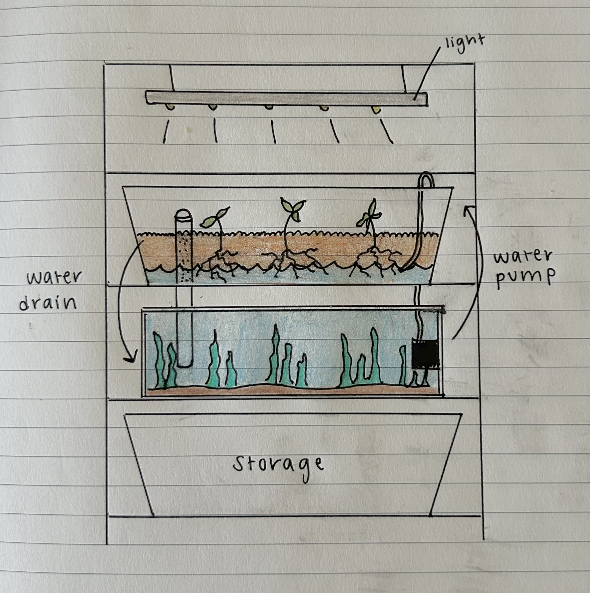
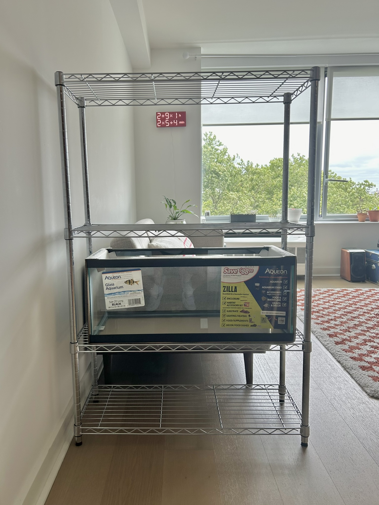
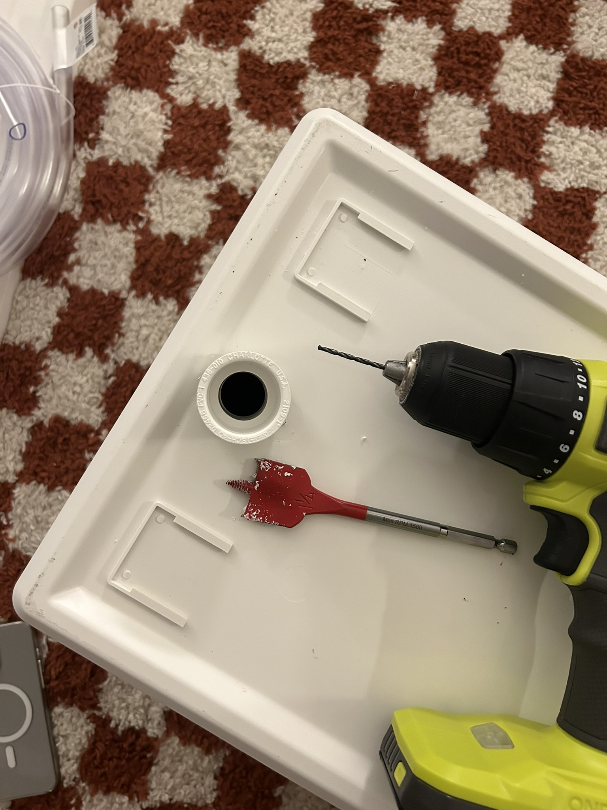
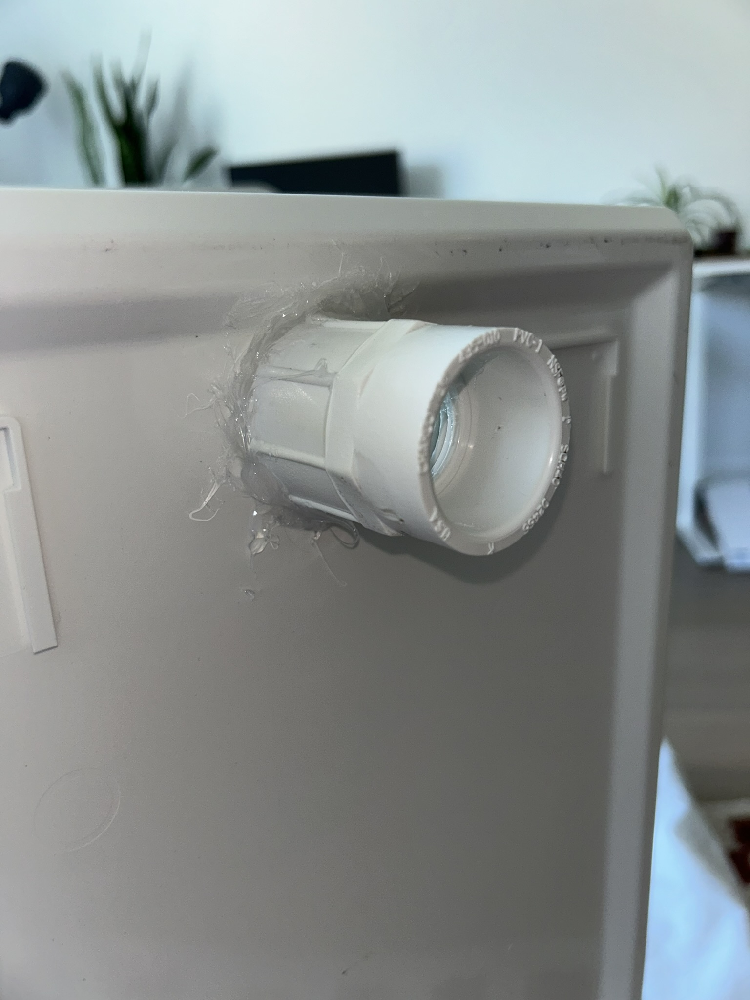
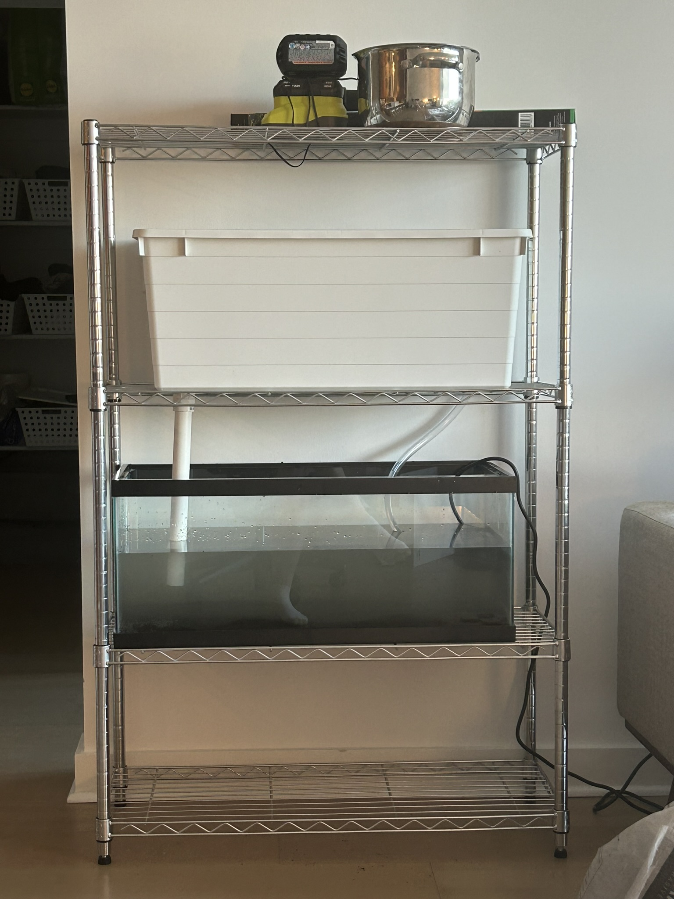
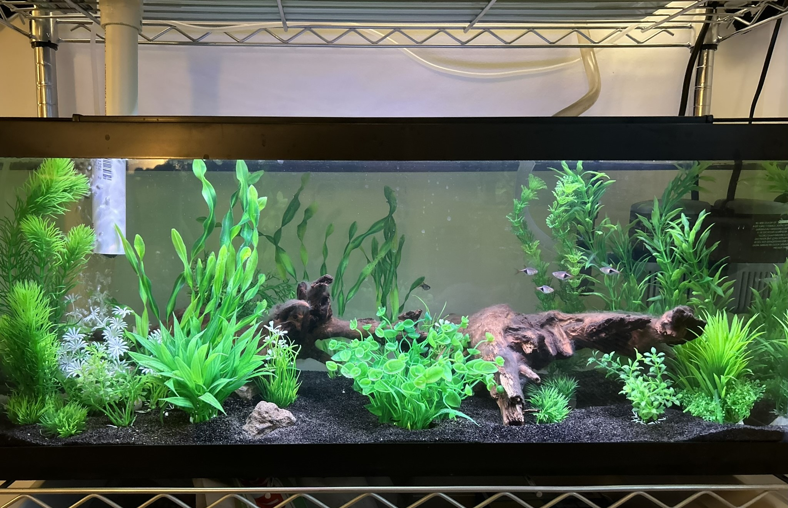
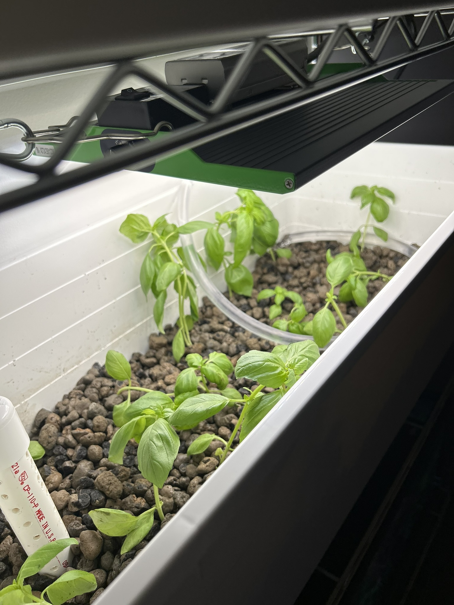
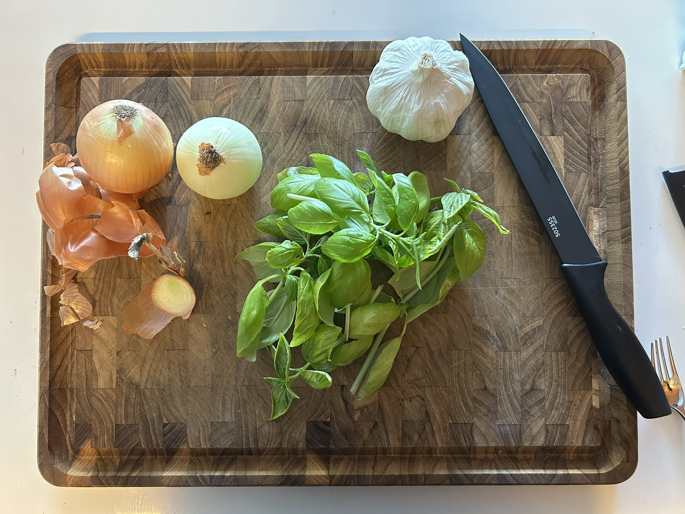

import fish from "./rasboras.mp4"
import shrimp from "./shrimp.mp4"
 
This is the home of my latest project/hobby/obsession, as my awesome boyfriend **[John](https://johnsutor.com/projects/aquaponics)** and I attempt to build a thriving aquaponics ecosystem in our NYC apartment (and learn a lot about combining nature and tech along the way).

A huge thanks is owed to **[\Art](https://backslash.org/)** 🎨 and Cornell Tech 🐻 for their microgrant program that has provided such valuable support to get this project started!

### 📋 *5.20.24* -- Planning the design

John and I just graduated and are soon starting our new jobs and moving into a new apartment. With all of these changes, we've decided to delay the building process until after our move, but I've kept busy reading up on aquaponics design and maintenance. After hours of perusing online videos and articles, sorting through various opinions on Reddit, and talking with local tank enthusiasts we settled on a few key design choices.

#### Selecting a media-based, continuous-flow system

We opted for a media-based aquaponics system, which means our plants are housed in a separate grow-bed filled with clay gravel. Water from the tank is pumped through the clay substrate, where the rooted plants filter out nutrients from the fish waste. Additionally, we opted for a continuous-flow system, which means that water is continuously being cycled from the tank through the bottom few inches of the media bed, before draining out the opposite side of the bed. This is an alternative to a flood & drain system, where a timed pump periodically fills the media bed with water before letting it drain completely. While continuous flow systems are somewhat limited to edible plants that don't mind a continuous stream of water past their roots, it also provides a much more stable water and nutrient level for the fish living in the tank.

<figcaption><b>Fig 1.</b> A final sketch of the design where water is pumped into the clay substrate on the right, and then flows back into the tank on the left.</figcaption>

#### Building vertically

We first decided to build a vertical system, where the grow bed of edible plants was placed above the aquatic tank for two primary reasons:
- To conserve the amount of space the system took up in our apartment.
- To reduce the odds of any potential leaks, as water that escapes from the grow bed will fall into the tank below.

We initially hoped to find or build some sort of wooden cabinet to house the structure, but quickly realized that the weight of the system is much greater than most furniture can hold. Furthermore, tank leaks and failures are almost always caused from the tank being on an uneven surface, so a sturdy & even support structure is essential. However, many commercially-available tank cases only consist of one shelf for a single tank to stand. In our case, we needed to have an equally strong secondary shelf above the tank to hold the grow bed. Ultimately, we decided to use an industrial metal shelf as the foundation of the system.

#### Limiting the tank size

With similar concerns in mind, we also decided to limit the tank size to 20 gallons, as the grow-bed above also contains an additional 10-15 gallons of water. Considering a gallon of fresh water weighs roughly 8.34lbs, this puts the entire weight of the system's water alone somewhere between 250 and 290lbs. Considering the weight threshold of the industrial shelving, and given that we live on a high floor in our building, we decided to constrain the system to this size for safety & flooding-risks. The tradeoff of this apartment-scale system is that we can only support a grow-bed of about 3 square feet, and are limited to smaller crops such as greens and herbs.

#### Starting with fake plants inside the tank

A key goal of our design is to give the fish and other aquatic creatures who live in our tank a safe and enjoyable habitat to live in. With this in mind, we decided to heavily-plant the tank to create lots of places for exploring and hiding. However, we also need to support the edible plants in the grow-bed without over-stocking the tank. Therefore, we have decided to start with fake plants inside of the tank, so that we can create a realistic environment for a small amount of creatures while reserving all of their waste nutrients for the edible plants. With time we may add aquatic plants to the tank, but initially we want to ensure there are enough nutrients to support both the ecosystem's plants and animals.

### 💰 *6.25.24* -- Purchasing components

After finishing the initial planning, it has taken quite a while to find all the right parts, in part because we've also been quite busy moving into the new apartment and starting work. These are all of the components we have purchased and their costs *(updates in italics)*.

#### Structural Components
- 3-shelf Home Depot adjustable metal rack -- [$165.39](https://www.homedepot.com/p/Tileon-3-Heavy-Duty-Wire-Rack-Metal-Shelves-1050-LBS-Height-Adjustable-Metal-Garage-Storage-Shelves-Chrome-YQHDRA093/330445086)
- 2 IKEA Sockerbit bins (grow bed + storage) -- [$59.98](https://www.ikea.com/us/en/p/sockerbit-storage-box-with-lid-white-40522088/)
- 20 gallon long Aqueon tank -- [$29.99](https://www.petco.com/shop/en/petcostore/product/aga-20g-30x12x12-lng-bk-tank-170933?store_code=3713&mr:device=c&mr:adType=pla_with_promotionlocal&gad_source=1&adlclid=ADL-83c348cb-ed98-4678-a7dc-748c351ef19e)

#### Building Tools 
- 1" x 2' PVC pipe -- [$3.14](https://www.homedepot.com/pep/IPEX-1-in-x-24-in-Rigid-PVC-Schedule-40-Pipe-22412/202300506?source=shoppingads&locale=en-US&pla&mtc=SHOPPING-BF-CDP-GGL-D26P-026_001_PIPE_FITTING-NA-NA-NA-PMAX-NA-NA-NA-NA-NBR-NA-NA-NEW-PMax_BHU24&gad_source=1)
- 1" [male](https://www.homedepot.com/pep/Cantex-1-in-PVC-Male-Terminal-Adapter-Conduit-Fitting-for-Cantex-PVC-Conduits-R5140105/202043379?source=shoppingads&locale=en-US&pla&mtc=SHOPPING-CM-CML-GGL-D27E-027_006_CONDUIT_FIT-NA-NA-NA-PMAX-5872413-NA-NA-NA-NBR-NA-NA-NEW-NA_2024_WHU24&gad_source=1) + [female](https://www.homedepot.com/pep/Carlon-1-in-PVC-Female-Adapter-E942F-10-HD/100403999?source=shoppingads&locale=en-US&pla&mtc=SHOPPING-RM-RMP-GGL-D27E-NA-NA-CARLON-NA-PMAX-NA-NA-MK863159001-24205-NBR-1131-NA-VNT-FY24_Q1_Q4_Thomas_Betts_ABB_D27_RM__AON&gad_source=1) PVC adaptors -- $4.14
- Diablo 1.25" spade drill bit (already owned a drill) -- [$6.77](https://www.homedepot.com/p/DIABLO-1-1-4-in-x-6-in-High-Speed-Steel-SPEEDemon-Spade-Drill-Bit-1-Piece-DSP2150/312953382)
- Everbilt 1/2" x 20' clear vinyl tubing -- [$12.97](https://www.homedepot.com/p/Everbilt-5-8-in-O-D-x-1-2-in-I-D-x-20-ft-Clear-PVC-Vinyl-Tube-702473/207144400)
- Hack saw -- [$5.47](https://www.homedepot.com/p/Husky-6-in-Mini-Hacksaw-with-Replaceable-Carbon-Steel-Blade-80-510-111/304583781)
- Imagitarium filter sponges - [$4.99](https://www.petco.com/shop/en/petcostore/product/imagitarium-2-pack-filter-sponges-2441408)

#### Digital Components
- Active Aqua 250GPH submersible water pump -- [$29.35](https://www.amazon.com/dp/B002JPGID2/ref=pe_386300_440135490_TE_simp_item_image)
- VIPARSPECTRA P1000 LED grow light -- [$64.80](https://www.amazon.com/dp/B083JVXHF6/ref=pe_386300_440135490_TE_simp_item_image)
- hygger LED tank light -- [$42.32](https://www.amazon.com/dp/B08N4W388K/ref=pe_386300_440135490_TE_simp_item_image)
- Aqueon preset 50W heater -- [$20.99](https://www.petco.com/shop/en/petcostore/product/aqueon-preset-aquarium-heater-50w-2335314)
- Uniclife aerator + air stones -- [$14.99](https://www.amazon.com/gp/product/B01EBXI7PG/ref=ppx_yo_dt_b_search_asin_title?ie=UTF8)

#### Substrates & Decor
- Geolite 45L clay pebbles -- [$52.87](https://www.amazon.com/dp/B07NCHM6KS?ref_=pe_386300_442618370_TE_sc_as_ri_0)
- Black diamond blasting sand -- [gifted](https://tractorsupply.com/tsc/product/black-diamond-medium-blasting-abrasives-3905403?store=2304)
- Majoywoo driftwood 12.5-18" 2 pack -- [$35.26](https://www.amazon.com/dp/B09J3ZW4BW?ref_=pe_386300_442618370_TE_sc_as_ri_0)
- MyLifeUnit aquarium plants -- [$22.85](https://www.amazon.com/dp/B093L893DX/ref=pe_386300_440135490_TE_simp_item_image)

#### Food & Water Quality 
- API freshwater testing kit -- [$35.48](https://www.amazon.com/API-FRESHWATER-800-Test-Freshwater-Aquarium/dp/B000255NCI/ref=asc_df_B000255NCI?mcid=d1e10664edba3ba1af6fdbd1181f67e9&hvadid=693348290062&hvpos=&hvnetw=g&hvrand=11105816434732191031&hvpone=&hvptwo=&hvqmt=&hvdev=c&hvdvcmdl=&hvlocint=&hvlocphy=9198132&hvtargid=pla-348697791053&psc=1)
- Seachem prime water conditioner -- [$13.56](https://www.amazon.com/Seachem-Prime-Fresh-Saltwater-Conditioner/dp/B00025694O/ref=sr_1_4?s=pet-supplies&sr=1-4)
- Tetra color tropical flakes -- [$7.99](https://www.petco.com/shop/en/petcostore/product/tetra-tetracolor-select-tropical-flakes-706-oz-3186429)
- *Hikari tropical mini algae wafers -- [$6.99](https://www.petco.com/shop/en/petcostore/product/hikari-tropical-mini-algae-wafers-077-oz-3857077)*
- *Hikari shrimp cuisine -- [$7.99](https://www.petco.com/shop/en/petcostore/product/hikari-shrimp-cuisine-035-oz-3110096)*

#### Living Components
- Trader Joes organic basil plant -- [$3.99](https://traderjoesrants.com/2024/05/08/trader-joes-organic-basil-plants/)
- 5 harlequin rasboras -- [$17.45](https://www.petco.com/shop/en/petcostore/product/harlequin-rasbora-%28rasbora-heteromorpha%29-3212818)
- *4 ghost shrimp -- $3.56*
- *2 nerite snails -- [$8.98](https://www.petco.com/shop/en/petcostore/product/red-racer-nerite-snail-3883507)*

***Total $682.26 + tax***

*Note -- while this is a significant upfront cost, nearly all of the purchases are one-time. So far, the ongoing maintenance costs (added electricity, fish food, additional plants and animals) have been negligible.*

### 🔨 *7.18.24* -- Putting it all together

Although it took some time to plan & purchase exactly what we needed, the actual system build was pretty quick. Here is a series of pictures showing each assembly step.

<figcaption><b>Fig 2.</b> We first put together the storage shelf and made sure that the shelves were perfectly aligned before placing the tank.</figcaption>

<figcaption><b>Fig 3.</b> We first used the spade drill bit to drill a hole into the bottom of the ikea tub & then fitted this with the male and female PVC connectors to ensure it was a tight fit.</figcaption>

<figcaption><b>Fig 4.</b> The left is a female adaptor, which we later switched to the bottom of the bin. The right is the male adaptor, which we later switched to the top of the bin.</figcaption>

<figcaption><b>Fig 5.</b> After ensuring the PVC connectors were a good fit, we sealed the small crack between the connectors and the tub with silicon to ensure a waterproof seal with no leaks.</figcaption>

<figcaption><b>Fig 6.</b> We then used the hack saw to cut the 2' PVC pipe roughly in half (left) and drilled drainage holes in the top half (right).</figcaption>

<figcaption><b>Fig 7.</b> The PVC pipe was placed in the adaptor and later even more drainage holes were added (left) before adding the clay substrate to the grow bed (right).</figcaption>

<figcaption><b>Fig 8.</b> Finally, we attached the other half of the PVC pipe to the bottom adaptor, added black sand in the tank, and ran some water with the pump + clear tubing to test the flow. After taking this picture, we ultimately cut the PVC pipe slightly shorter and fixed the silicon so it wasn't crooked. We also added some more drainage holes, and used a small piece of extra filter sponge inside the drainage pipe to dampen any noise from the water draining.</figcaption>

### 🐟 *8.10.24* -- Planting & cycling

After some adjustments and waiting for the substrate to settle, we've finally reached the most exciting part! To decorate the tank, we carefully washed the fake plants, extensively boiled the driftwood, and used the remaining silicon to glue the driftwood to some rocks I found outside so it wouldn't float. We also added a heater and a bubbler for necessary warmth and extra oxygen. Later we found out that the fish love to ride the bubbler up like jet stream!

<figcaption><b>Fig 9.</b> Plants, driftwood, and the first fish friends inside our tank.</figcaption>

We then introduced the first fish to our tank -- 5 baby harlequin rasboras!

<video src={fish} controls muted></video>

At this time, we've also introduced some starter plants into the grow bed to help clean any nutrients out of the water as the tank cycles.
We purchased an organic basil plant from Trader Joes, and carefully separated each baby basil plant from it. We then washed all of the soil
from the plant roots, and carefully planted them in the clay substrate.

At this time, we have also set up the plant grow-light, a tank light, and a tank heater and bubbler. 

<figcaption><b>Fig 10.</b>Photo taken right after we planted the basil as an initial crop to start our system. 
We plan to add other herbs and greens once the tank has matured.</figcaption>

#### An important note on tank cycling

In any aquarium, bacteria turn ammonia from animal waste into nitrites, and other bacteria convert that nitrite into nitrate, which can then be consumed by the plants in the grow bed.
However, it takes some time for these bacteria colonies to build up in the system. This build-up process is known as cycling the tank, and there are two ways to do it.
The first is fish-out cycling, which involves adding some fish food or organic matter into the tank, which leads to the growth of these bacteria before
any fish enter the system. The other form is fish-in cycling, which involves stocking the tank very minimally and allowing the bacteria to slowly grow from the fish waste.

We initially went with fish-in cycling, because we were eager to see fish in our beautiful tank. However, after doing more research, we will instead go with fish-out
cycling in any future tanks, because we learned that it it can be both stressful and deadly for the fish if the ammonia, nitrite, or nitrate levels get too high. It is also much faster than fish-in cycling.
The entire cycling process took about two months, and we had to measure the levels of ammonia, nitrite, and nitrate every day to ensure the fish would be happy and healthy. 
One great product was prime water conditioner, as every two to three days we would add a small pot of conditioned water to replace any water that had evaporated over that time. 
While using this conditioner slows the process of cycling, it ultimately kept our fish healthy and made it much safer for them.

### 🐌 *10.31.24* -- Adding more friends

After the tank was cycled and nutrient levels remained stable, it was time to add more friends. We purchased 4 ghost shrimp and 2
nirite snails, which have proven to be a great clean-up crew. The shrimp are very smart and bold; although they primarily forage for food scraps
along the bottom of the tank, they will frequently swim to the surface and steal food flakes from the rasboras. The two snails are also 
hard workers, and have quickly cleaned all of the tanks glass (they are now working on the driftwood's algae).

<video src={shrimp} controls muted></video>

### 💡 *11.30.24* -- Harvesting + Future plans

After learning a few things about caring for basil (particularly that it doesn't like 24/7 sunshine), it quickly grew strong roots and has given us 
a few plentiful harvests. Now that the tank is thriving and stable, we plan to add other herbs and possibly some winter greens to the grow bed.
We are also already planning to add more ghost shrimp, and possibly a small school of pygmy corydoras as well.

<figcaption><b>Fig 11.</b> First basil harvest, which we used to make a thai curry dish.</figcaption>