import drainage_check from "./check.MOV"

About two years ago, my awesome boyfriend [John](https://johnsutor.com/projects/aquaponics) and I set out to create an aquaponics system in our 1 bedroom NYC apartment. Since my [first post](https://erinmurphy.dev/projects/project-1) was more of a chronological journal about the build (and we've learned A LOT since then) I hope this one will serve as a practical guide for replicating our setup and avoiding our mistakes!

## Aquaponics 101

[Aquaponics](https://en.wikipedia.org/wiki/Aquaponics) is the practice of combining aquaculture (breeding, rearing, and harvesting water organisms) with hydroponics (growing plants without soil). Frequently this is done in large scale industrial farms where both the plants and animals are raised for food, though there are many thriving [online communities](https://www.reddit.com/r/aquaponics/) of home aquaponics enthusiasts. 

There are many [different kinds](https://gogreenaquaponics.com/blogs/news/guide-to-the-different-types-of-aquaponics-systems?srsltid=AfmBOoqs0w-mqaDIYjRNjBuhvVzdy66ARCWzGdRX9etGm9HxapYXip_s) of aquaponics systems, but (to the best of my knowledge) they all share the same cycle: fish waste water provides nutrients to plants, which in turn filter the water. Despite, the abundance of online resources, when John and I first became interested in setting up a home system we noticed most examples still used tanks and grow-beds that would be far too large and risky for our NYC apartment. This has motivated us to share our experiences and we hope that this guide may be useful to others looking to create a similar setup!

This guide consists of the following sections:
- **Our System:** a high-level overview of our current system design
- **Recent Improvements:** highlights of what we have recently changed compared to our initial build
- **Lessons Learned:** mistakes we learned the hard way
- **Step-by-Step Build Guide:** for if you too want to be a city aquaponics farmer!

## Our System

### Media-Based Continuous Flow
We opted for a media-based aquaponics system, which means our plants are housed in a separate grow-bed filled with clay gravel. Water from the tank 
is pumped through the clay substrate, where the rooted plants filter out nutrients from the fish waste. Additionally, we opted for a continuous-flow system, 
which means that water is continuously being cycled from the tank through the bottom few inches of the media bed, before draining out the opposite side of the 
bed. This is an alternative to a flood & drain system, where a timed pump periodically fills the media bed with water before letting it drain completely. 
While continuous flow systems are somewhat limited to edible plants that don't mind a continuous stream of water past their roots, it also provides a much more 
stable water and nutrient level for the fish living in the tank.

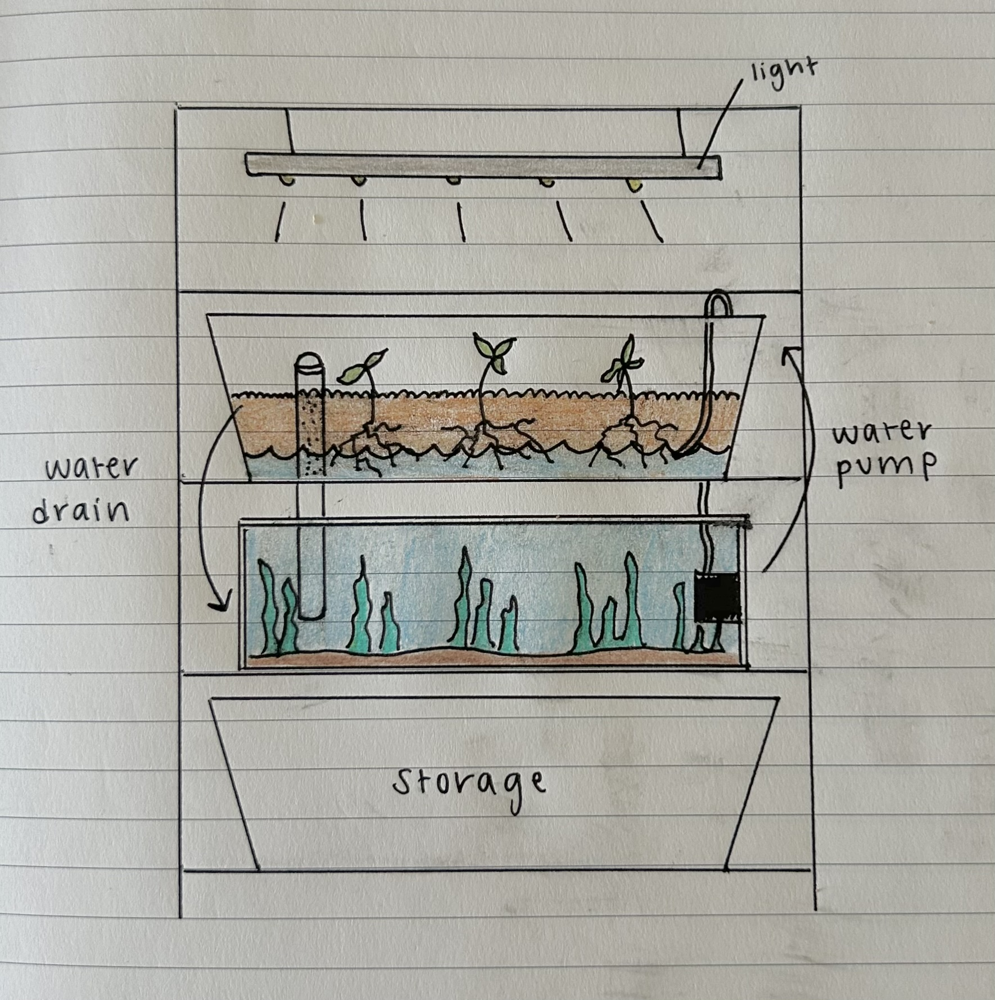
<figcaption><b>Fig 1.</b> A final sketch of the design where water is pumped into the clay substrate on the right, and then flows back into the tank on 
the left.</figcaption>

### Vertical Design
We decided to build a vertical system, where the grow bed of edible plants was placed above the aquatic tank for three primary reasons:
- To conserve the amount of space the system took up in our apartment.
- To reduce the odds of any potential leaks, as water that escapes from the grow bed will fall into the tank below.
- To reduce energy costs, as the water only needs to be pumped a short distance up into the grow bed, and will then be gravity fed back into the tank.

We decided to use an industrial metal shelving rack as the foundation of our system; a practical and stable option that can support both the heavy tank and grow-bed. The rack is about 3ft wide and fits inside a spare closet space in our new apartment (a true NYC luxury).

TODO: add image of shelf in closet

### Small Size
With similar concerns in mind, we also decided to limit the tank size to 20 gallons, as the grow-bed above also contains an additional ~10 gallons of water. 
Since a gallon of fresh water weighs roughly 8.34lbs, we estimate this puts the entire weight of the system's water somewhere between 170 and 250lbs. 
Considering the weight threshold of the industrial shelving, and given that we live on a high floor in our building, we decided to constrain the system 
to this size for safety & flooding-risks. The tradeoff of this apartment-scale system is that we can only support a grow-bed of about 3 square feet, 
and are limited to crops with smaller root systems that don't require a lot of nutrients (such as leafy greens and herbs).

### Grow-Bed
Our grow-bed consists of clay pebbles and a drainage tube. We recently added a bag of crushed coral as an additional filter within the drainage tube. This helps catch waste, soften any drainage sounds, and adds extra minerals to the water that our shrimp and snails need for healthy molting and shells, respectively. Currently, we are growing basil and we just added two 'Tiny Tim' dwarf tomato seedlings as an experiement to see if we can support fruiting plants. We've previously had success with growing basil, mint, and lettuce plants.

### Tank & Aquatic Friends
Our tank is currently home to MANY neocaridina (cherry) shrimp and ramshorn snails, which snuck in on some plants and multiply like crazy. We also have a single nerite snail and a feeder guppy. 

## Recent Improvements

- **Improved drainage:** In our original design we used only a small 1" pvc pipe with holes drilled into it for drainage. However, we quickly realized it was very easy for this to get clogged with plant roots or debris. To improve the drainage, we switched the top pipe to a 6" PVC pipe inside the grow bed, and drilled vertical stripes around its lower perimeter, which allows for much more water flow than the previous pipe. We placed a bag of crushed coral inside this tube to filter out fine particles, muffle any drainage sounds, and add minerals to the water. The bottom pipe is still the original 1" pipe, but we found using a small rubber bulkhead fitting works much better at preventing leaks than our original sealant. 
- **Better pump:** Our 250GPH original pump unexpectedly stopped working after our move. However, this turned out to be for the best because we had realized that a smaller 160GPH pump worked just as well, while being smaller, quieter, and cheaper.
- **Moved the grow light:** Originally we had attached the grow light to the top rack of the shelf. This worked fairly well, but often caused burns on leaves of delicate herbs like our basil. In our setup's new closet location, we hung the grow light about a half a foot higher and have it on a timer to run for 8hrs per day. Our plants are still growing great without any burns or heat damage.

## Lessons Learned
- **Cycling!** When we initially got our tank, we were more focused on the aquaponics research and unfortunately underestimated the fragility of a young fish tank. We have since learned the value of cycling, and would highly recommend setting up your system for at least a few weeks (to establish healthy bacteria) before adding in any larger creatures.
- **Bigger tank = better:** If you have the space for a larger tank, I would highly recommend it. The unfortunate downside of smaller tanks is any small changes in water quality (for example, if a fish is sick or if you accidentally add too much food) can quickly negatively impact the entire tank. Larger tanks are generally considered more stable. They can also support more fish, which means more nutrients to grow more plants (or plants that require more nutrients).
- **Success with shrimp, snails, & feeders:** If you read my previous post, our tank has previously been home to some classic freshwater fish like harlequin rasboras, neon tetras, and salt & pepper corys. Unfortunately, despite our excellent water parameters and careful parenting, we had quite a bit of bad luck with a parasite problem infecting all of our fish besides our one feeder guppy who had snuck in with a bag of shrimp. We learned the hard way that many of these popular species can have major immunity issues and may be bred in poor conditions. If possible, getting fish from local enthusiasts is both cost-effective and a great way to ensure they are adjusted to your area's water parameters. Also, less flashy species (like feeder guppies) can be both beautiful and much more resilient than their famous cousins.
- **Importance of not overfeeding (esp with travel):** Many of our fish ailments began with great intentions when we purchased an automatic-feeder prior to a long international trip. However, this device ended up overfeeding our tank, causing a huge algea bloom and terrible water quality. We learned from our local fish store that fish can actually go a few weeks without food in a well-planted tank and from another enthusiast that "hungry fish are healthy fish." We've since been much more cautious about overfeeding and our tank has thrived.
- **Better drainage:** As discussed above, a bigger drainage pipe in the grow bed will make maintenance much easier in the future.
- **Planted tank communities rock:** There is a fantastic active planted tank community on Facebook in the NYC area and we had a great experience swapping some of our overgrown plants for another hobbiest's neocaridina shrimp, starting our current population. I would highly recommend looking for similar groups in your area for both advice and cost-effective fish and plants that do well in your area's water.

## Step-By-Step Build Guide

### I. Materials

#### Structural & Building
- 3-shelf Home Depot adjustable metal rack -- [$165.39](https://www.homedepot.com/p/Tileon-3-Heavy-Duty-Wire-Rack-Metal-Shelves-1050-LBS-Height-Adjustable-Metal-Garage-Storage-Shelves-Chrome-YQHDRA093/330445086)
- 2 IKEA Sockerbit bins (grow bed + storage) -- [$59.98](https://www.ikea.com/us/en/p/sockerbit-storage-box-with-lid-white-40522088/)
- 20 gallon long Aqueon tank -- [$29.99](https://www.petco.com/shop/en/petcostore/product/aga-20g-30x12x12-lng-bk-tank-170933?store_code=3713&mr:device=c&mr:adType=pla_with_promotionlocal&gad_source=1&adlclid=ADL-83c348cb-ed98-4678-a7dc-748c351ef19e)
- Diablo 1.25" spade drill bit (already owned a drill) -- [$6.77](https://www.homedepot.com/p/DIABLO-1-1-4-in-x-6-in-High-Speed-Steel-SPEEDemon-Spade-Drill-Bit-1-Piece-DSP2150/312953382)
- Everbilt 1/2" x 20' vinyl tubing (black to reduce algea growth) -- [$12.97](https://www.homedepot.com/p/Everbilt-5-8-in-O-D-x-1-2-in-I-D-x-20-ft-Clear-PVC-Vinyl-Tube-702473/207144400)
- Hack saw -- [$5.47](https://www.homedepot.com/p/Husky-6-in-Mini-Hacksaw-with-Replaceable-Carbon-Steel-Blade-80-510-111/304583781)
- 1" x 1' PVC pipe -- [$3.14](https://www.homedepot.com/pep/IPEX-1-in-x-24-in-Rigid-PVC-Schedule-40-Pipe-22412/202300506?source=shoppingads&locale=en-US&pla&mtc=SHOPPING-BF-CDP-GGL-D26P-026_001_PIPE_FITTING-NA-NA-NA-PMAX-NA-NA-NA-NA-NBR-NA-NA-NEW-PMax_BHU24&gad_source=1)
- 6" x 2' PVC pipe* -- [$22.85]( https://www.homedepot.com/p/Charlotte-Pipe-4-in-x-2-ft-PVC-DWV-Sch-40-Pipe-PVC074000200HA/100566597?MERCH=REC-_-rv_nav_plp_rr)
- 1" male PVC adaptor [$2.07](https://www.homedepot.com/pep/Cantex-1-in-PVC-Male-Terminal-Adapter-Conduit-Fitting-for-Cantex-PVC-Conduits-R5140105/202043379?source=shoppingads&locale=en-US&pla&mtc=SHOPPING-CM-CML-GGL-D27E-027_006_CONDUIT_FIT-NA-NA-NA-PMAX-5872413-NA-NA-NA-NBR-NA-NA-NEW-NA_2024_WHU24&gad_source=1)
- 1" bulkhead fitting* [$8.99](https://www.amazon.com/dp/B0C9BLJ4WR)

#### Electronics
- Active Aqua 160GPH submersible water pump* -- [$19.39](https://www.amazon.com/dp/B002JPGE6S)
- VIPARSPECTRA P1000 LED grow light -- [$64.80](https://www.amazon.com/dp/B083JVXHF6/ref=pe_386300_440135490_TE_simp_item_image)
- hygger LED tank light -- [$42.32](https://www.amazon.com/dp/B08N4W388K/ref=pe_386300_440135490_TE_simp_item_image)
- Aqueon preset 50W heater -- [$20.99](https://www.petco.com/shop/en/petcostore/product/aqueon-preset-aquarium-heater-50w-2335314)
- (Optional) Uniclife aerator + air stones -- [$14.99](https://www.amazon.com/gp/product/B01EBXI7PG/ref=ppx_yo_dt_b_search_asin_title?ie=UTF8)

#### Tank Substrate, Decor, Maintenance
- Geolite 45L clay pebbles -- [$52.87](https://www.amazon.com/dp/B07NCHM6KS?ref_=pe_386300_442618370_TE_sc_as_ri_0)
- Black diamond blasting sand -- [gifted](https://tractorsupply.com/tsc/product/black-diamond-medium-blasting-abrasives-3905403?store=2304)
- Majoywoo driftwood 12.5-18" 2 pack -- [$35.26](https://www.amazon.com/dp/B09J3ZW4BW?ref_=pe_386300_442618370_TE_sc_as_ri_0)
- Crushed coral bag* -- [$11.99](https://www.amazon.com/SuSulaicai-Crushed-Freshwater-Aquarium-Reusable/dp/B0FRN87PM6/ref=sr_1_10)
- Vivosun 1" rockwool cubes* -- [$8.99](https://www.amazon.com/VIVOSUN-Rockwool-Hydroponics-Propagation-Startling/dp/B0CQ7W5RZZ/ref=sr_1_3_sspa)

#### Food & Water Quality
- API freshwater testing kit -- [$35.48](https://www.amazon.com/API-FRESHWATER-800-Test-Freshwater-Aquarium/dp/B000255NCI/ref=asc_df_B000255NCI?mcid=d1e10664edba3ba1af6fdbd1181f67e9&hvadid=693348290062&hvpos=&hvnetw=g&hvrand=11105816434732191031&hvpone=&hvptwo=&hvqmt=&hvdev=c&hvdvcmdl=&hvlocint=&hvlocphy=9198132&hvtargid=pla-348697791053&psc=1)
- Seachem prime water conditioner -- [$13.56](https://www.amazon.com/Seachem-Prime-Fresh-Saltwater-Conditioner/dp/B00025694O/ref=sr_1_4?s=pet-supplies&sr=1-4)
- Tetra color tropical flakes -- [$7.99](https://www.petco.com/shop/en/petcostore/product/tetra-tetracolor-select-tropical-flakes-706-oz-3186429)
- Hikari shrimp [pellets](https://www.petco.com/product/hikari-shrimp-cuisine-035-oz-3110096) and algea [wafers](https://www.petco.com/product/hikari-tropical-algae-wafers-for-plecostomus-and-algae-eaters-110140)* -- $10.98
- KatsAquatics calcium treats* -- [$14.99](https://www.amazon.com/Limited-Calcium-Tablets-Nutrition-Immunity/dp/B09R17856Z)

#### Plants & Animals
- Neocaridina shrimp, nerite snails, feeder guppies* -- traded for plants
- Aquatic plants (susswassertang, anubias, cryptocoryne, java fern, duckweed)* -- gifted
- Organic basil seedlings - [$3.99](https://traderjoesrants.com/2024/05/08/trader-joes-organic-basil-plants/)
- Various greens seeds

***Total $663.24 + tax***

*\* New purchase (since original build blog)*

*Note -- while this is a significant upfront cost, nearly all of the purchases are one-time. So far, the ongoing maintenance costs 
(added electricity, fish food, additional plants and animals) have been negligible. In fact, all of our current plants and animals we have gotten for free via gifting or trading in planted tank online communities*

### II. Building the Setup

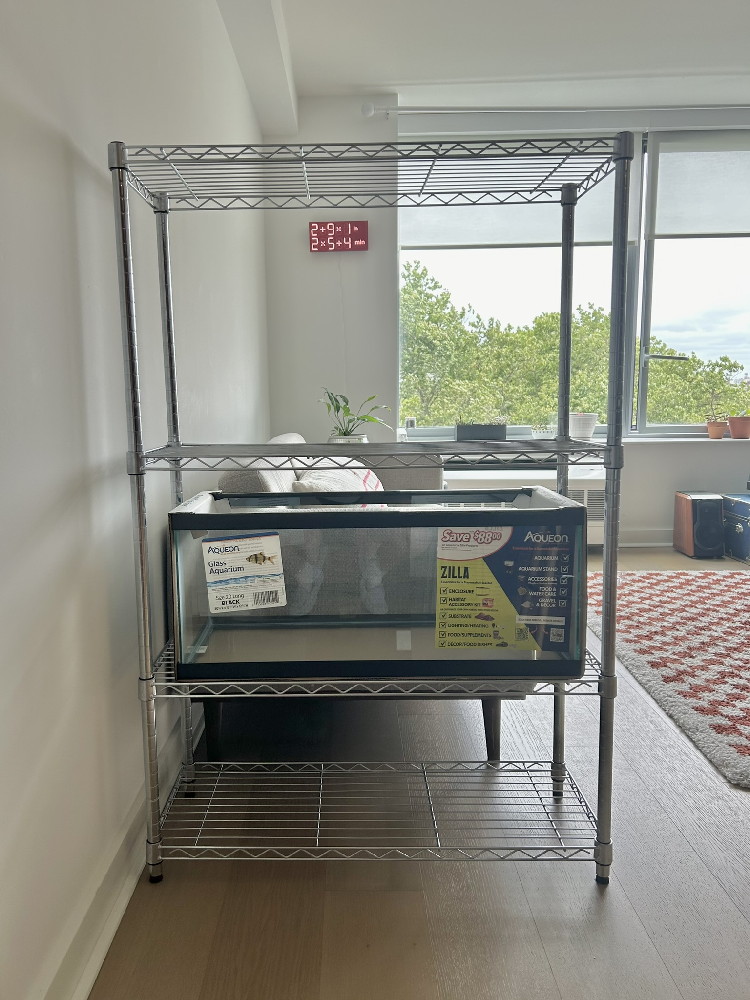
<figcaption>Fig 2: Rack setup in our old apartment (we now store the setup in a spare closet).</figcaption>
We first put together the storage shelf and made sure that the shelves were perfectly aligned before adding anything to the tank. Not pictured here, but the plastic IKEA bin we use as a grow-bed goes on the upper shelf above the tank.

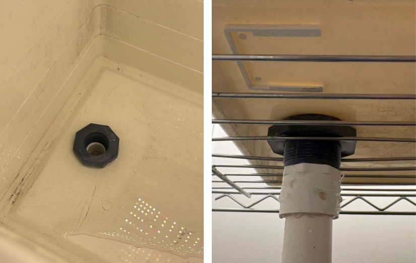
<figcaption>Fig 3: Drainage hole with bulkhead and lower drainage pipe.</figcaption>

We used the spade drill bit to drill a drainage hole into one end of the grow-bed, fitted this with the bulkhead, and tested that it was water tight (left). We then used the male adaptor to attach the 1" PVC pipe (cut to length with a hack saw) to the underside of the drainage hole. You'll need to bend the shelf bars slightly to fit the PVC (right).

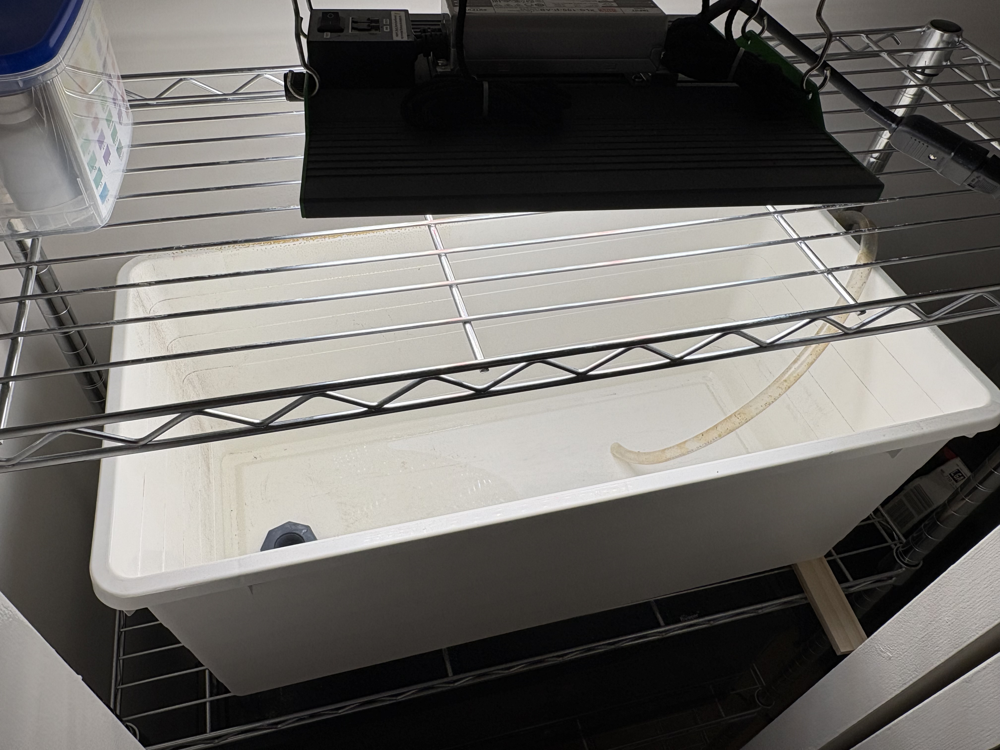
<figcaption>Fig 4. View of the empty grow-bed, where water flows from right to left. </figcaption>

At this point, your grow-bed will look something like Fig 4 (minus the tube on the right), with the tank below. We currently hang the grow-light above the shelf within our closet, but you can also attach it to the top rack of the shelf. This is optional, but we found adding the slightest angle to the grow-bed (in our case using an old paint stick to barely prop up the right side) helps keep water moving through the bed.

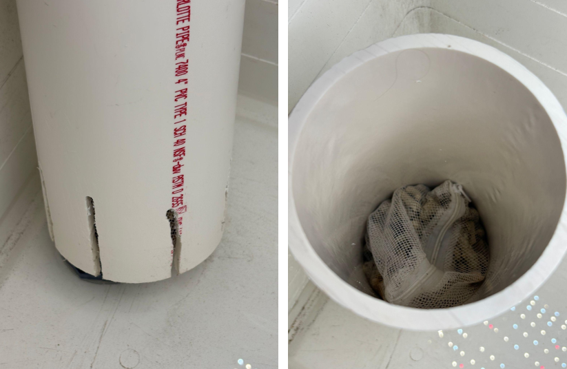
<figcaption>Fig 5. Grow-bed drainage pipe and crushed coral filter</figcaption>
Within the grow-bed, we place a larger 4" PVC pipe (also cut to length) around the bulkhead hole and used a drill to create vertical drainage holes in the base (left). This allows water to drain quicker and is easier to maintain than our previous setup which used another 1" PVC pipe on top. Inside this pipe we use a bag of crushed coral to catch debris, prevent drainage sounds, and add healthy minerals to the water for our invertebrates (right)

<video src={drainage_check} controls muted></video>
<figcaption>Fig 6: Check water drains as expected</figcaption>
At this point, I would recommend you check that the drainage is water-tight and working as expected by adding some water to the grow-bed (either via the pump/tubing or manually) to see how it drains.

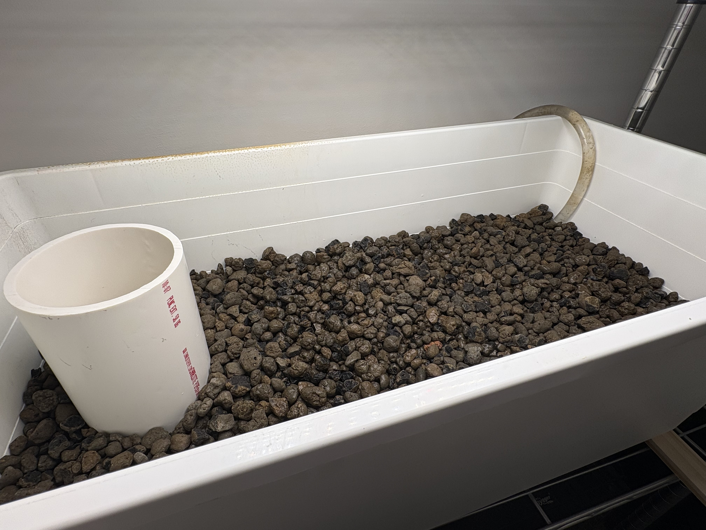
<figcaption>Fig 7: Grow-bed filled with clay pebbles</figcaption>
Once the drainage is working well, the clay pebbles can be rinsed and added to the grow-bed.

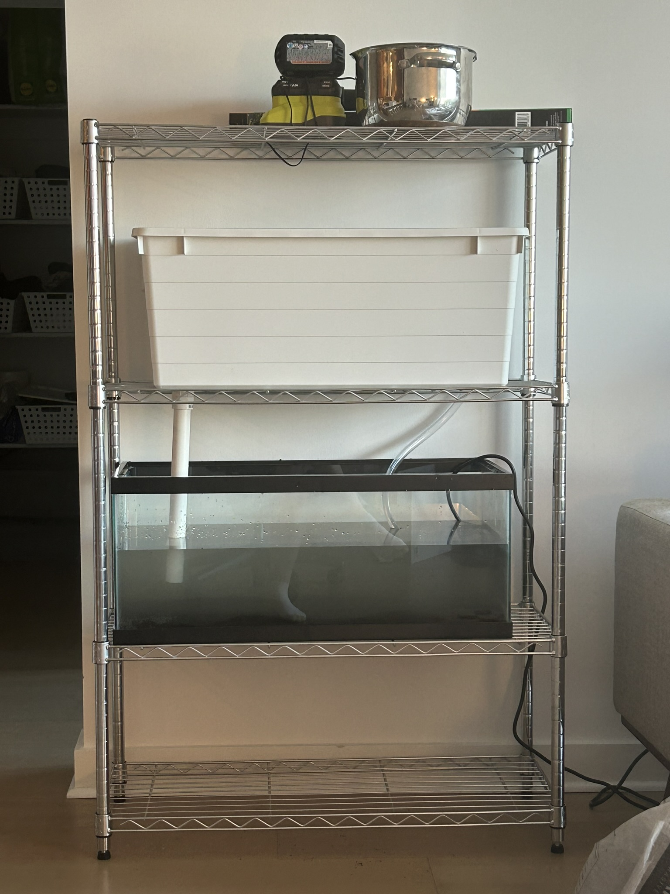
<figcaption><b>Fig 8:</b>Setup adding some cloudy water</figcaption>

We next rinsed and added a layer of the black sand into the tank. We also began adding filtered water (with dechlorinator) to the tank and setup the pump and vinyl tubing to test the full flow (note - we used clear tubing but I would recommend black to prevent algae growth)

This was an old picture we took when initially creating the setup. After taking this, we cut the PVC pipe shorter and straightened it out. I also learned that pouring water onto a plastic lid prevents the sand from stirring up and making the water murky (though it will eventually settle).

### III. Planting & Cycling

While the substrate settled, we boiled the driftwood (to remove tannins that will turn the water brown) and planned how we wanted the tank to look.

<figcaption><b>Fig 9:</b>Plants, driftwood, and some rocks in our tank</figcaption>

We first used plastic plants in our tank, but later switched to live plants after a friend gifted us some. Live plants help keep the tank stable and to create a beautiful changing aquascape as they grow. They can be expensive, so I highly recommend looking into fast-growing ones or hobbiests in your community who frequently donate or inexpensively sell their excess growth.

We have had success growing susswassertang, anubias, cryptocoryne, java fern, and duckweed. We initially used clear fishing line to tie some of the plants (anubias and java fern) to driftwood and stones. Other plants we directly rooted into the dirt.They all grow so much that we've now been able to gift our excess plants and we also traded some for cherry shrimp.

At this point, it is very tempting to want to get fish right away, which is what we naively did when we first set-up our tank. However, it can take at least a month for the tank's beneficial bacteria to grow, which are needed to consume toxins from the fish waste. There are plenty of online guides for cycling a tank, and I would highly recommend leaving the tank for a while and only adding animals once the water quality is stable.

### IV. Adding Life

Once your tank is cycled, it is time to plant the grow-bed and add friends! You'll first want to setup the grow-bed light, tank light, tank heater, and optionally a bubbler (for extra oxygen until the plants have grown in).

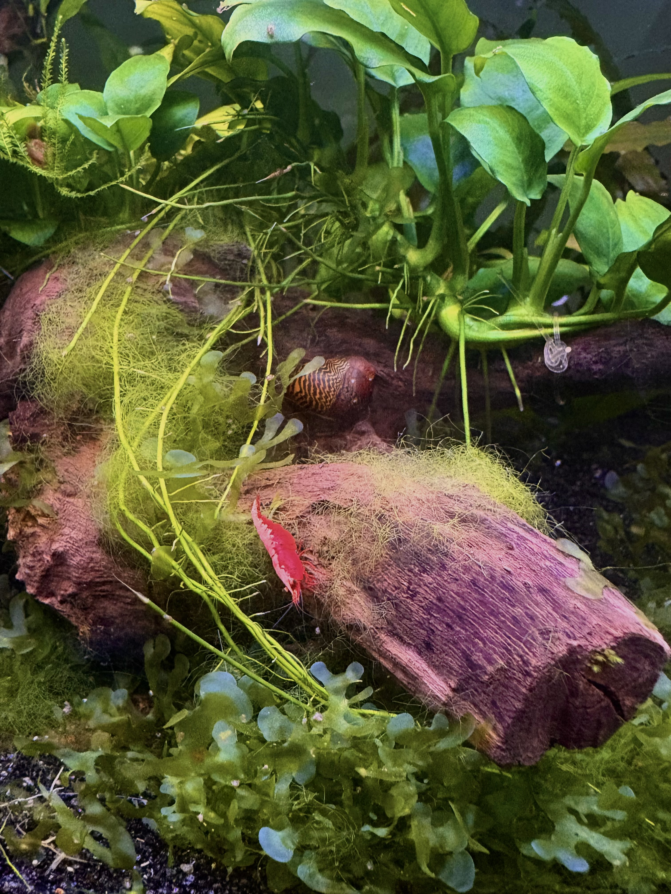
<figcaption><b>Fig 10:</b>A nerite snail and cherry shrimp on our driftwood. Spot the clear fishing line helping our anubias attach to the wood.</figcaption>

After our recent move, we traded some of our excess plants for about 20-30 cherry shrimp. These have been thriving and have laid multiple rounds of eggs. A tank of our size can easily hold hundreds of small shrimp, so we are excited to see the population grow.

We also have loads of ramshorn snails (which came in from some plants and reproduce quickly), a nerite snail, and a small feeder guppy which snuck into the shrimp bag as a tiny baby and has since grown up to be the king of the tank.

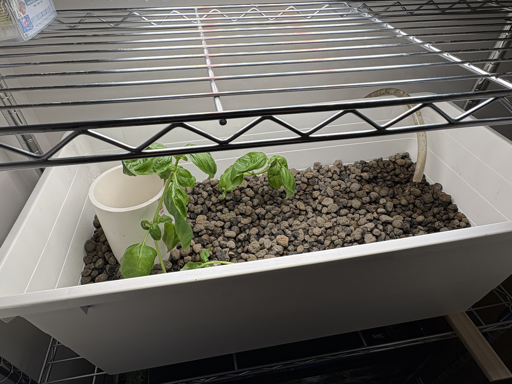
<figcaption><b>Fig 11:</b>Organic basil seedlings in the grow-bed.</figcaption>

Once you have animals providing waste to the system, you can begin growing crops in the grow-bed!  An easy way to quickly add plants is to purchase organic herb seedlings (we got basil from Trader Joes), split them into the individual plants, and wash the dirt from their roots before carefully planting in the clay.

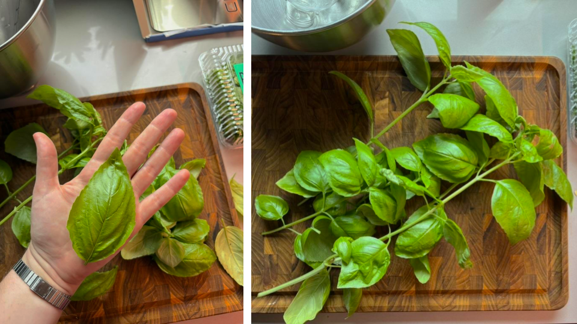
<figcaption><b>Fig 12:</b>Giant harvested basil leaves.</figcaption>

The seedlings may look a little sad and limp at first, but should quickly grow into healthy vibrant plants that we harvest nearly every week (always trimming close to where leaves split at the base to create more stems).

<figcaption><b>Fig 13:</b>Tomato seedlings in rockwool on a sunny windowsill.</figcaption>

If you want to grow plants but can't find local seedlings (*cough* NYC in the winter months *cough*), another great option is to order seeds online and grow them into seedlings using rockwool cubes. The photo above is seedlings of a micro-tomato variety called Tiny Tim that we are currently attempting to grow. We've previously successfully grown lettuce from seed in our grow-bed.

For these, I soak the rockwool in a slightly acidic water, make a tiny hole in each for a seed, and set the cubes in some water with plastic wrap covering the tupperware to keep them humid. After a few weeks once the seedlings have grown longer roots, I carefully remove most of the wool cubes and gently plant them in the growbed.

### V. Maintenance

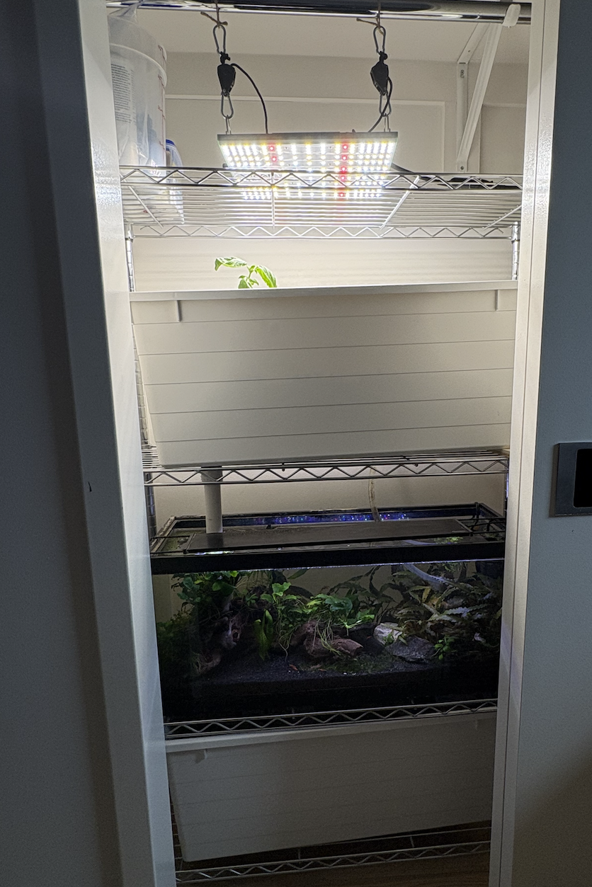
<figcaption><b>Fig 14:</b>Full setup in our spare closet.</figcaption>

Now that we've perfected our setup, it is wonderfully low-maintenance. The plants, shrimp, and snails keep the water quality pristine, the larger pipe keeps the grow-bed draining well, and the grow-light placement and timer is causing our plants to grow quickly.

Our regular maintenance of the system includes the following:
- Feeding the shrimp and fish roughly once every two days
- Replacing a few gallons of the water with fresh water (that's been treated with Prime dechlorinator)
- Eating the fresh basil
- Removing any dead plant leaves or overgrowth and stirring up the sand slightly if waste accumulates (so it gets sucked up by the pump) as needed - maybe once every few weeks.

Otherwise, it is now a healthy balanced ecosystem that thrives with little-to-no involvement from us!  

While we are by no means aquaponics experts, we are always happy to share the lessons we've learned and hope this guide is helpful. Please feel free to reach out if you are thinking of starting an apartment system of your own and have any questions!
